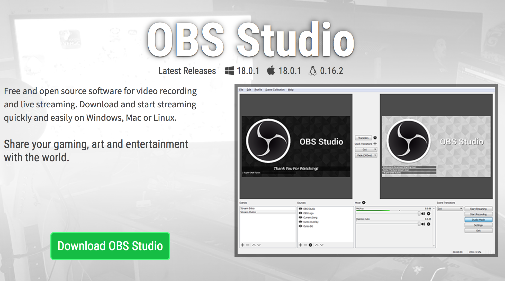
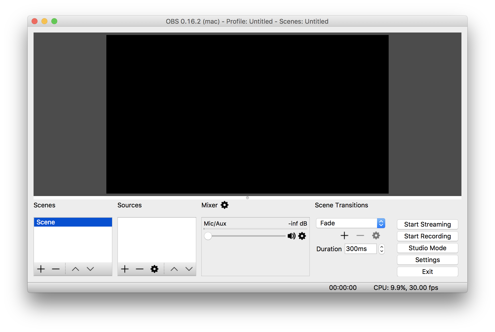

---
related:
    - obs/webkamera-i-obs.md
    - obs/koble-obs-til-youtube.md
    - obs/koble-obs-til-facebook.md
---

OBS Studio kan lastes ned gratis på [obsproject.com](https://obsproject.com).

Klikk på den grønne knappen "Download OBS Studio", og så får du følgende tre knapper:

Velg den knappen som passer til ditt operativsystem.

Du vil nå laste ned en installasjonsfil til OBS. Åpne den, og gå gjennom alle stegene for å installere OBS.

Når det er ferdig, så åpner du OBS. Det skal se omtrent slik ut:

## Linux

Bruker du linux, må du etter du ha installert OBS også installere en [BrowserSource plugin](https://github.com/bazukas/obs-qtwebkit).

I tilegg finnes det kun støtte for èn spesifikk konverter til  elgato. Se [Github for mer info](https://github.com/tolga9009/elgato-gchd).

Vi anbefaler derfor Windows eller macOS.
