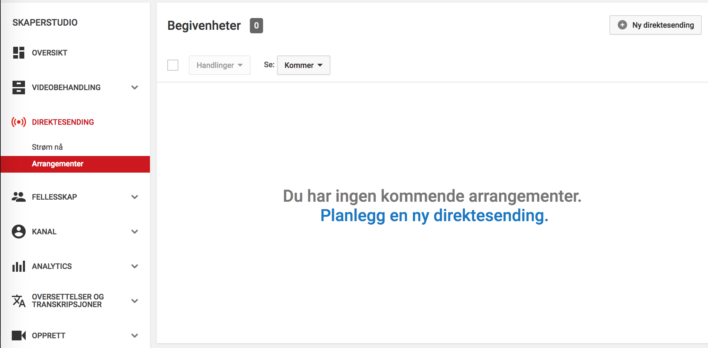
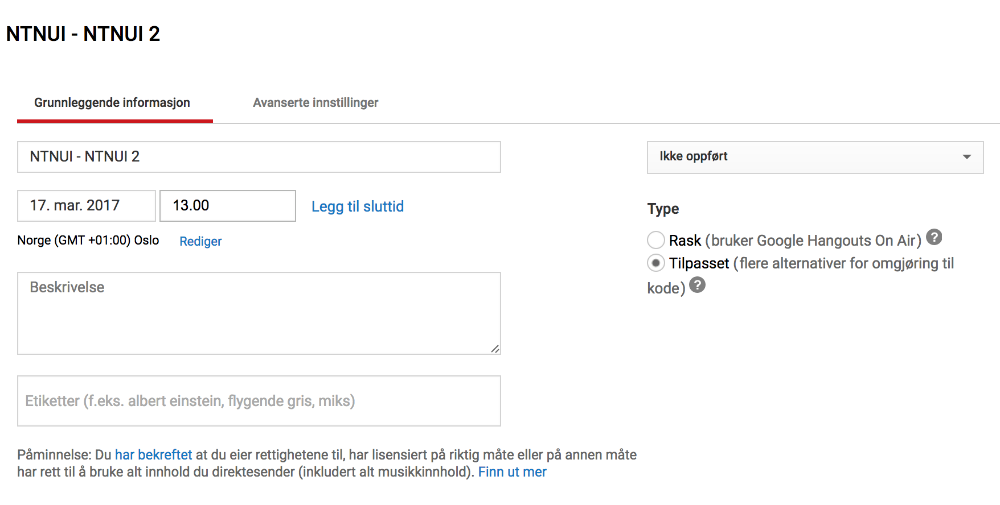
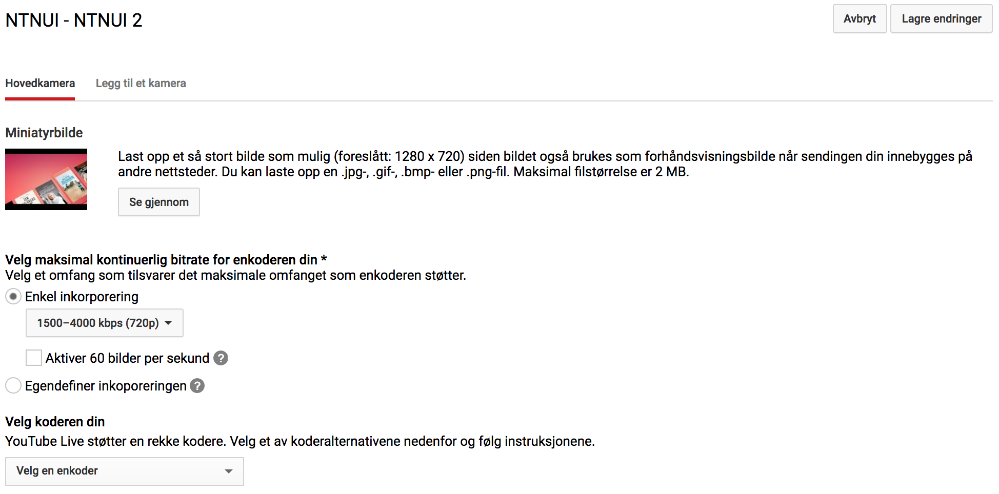
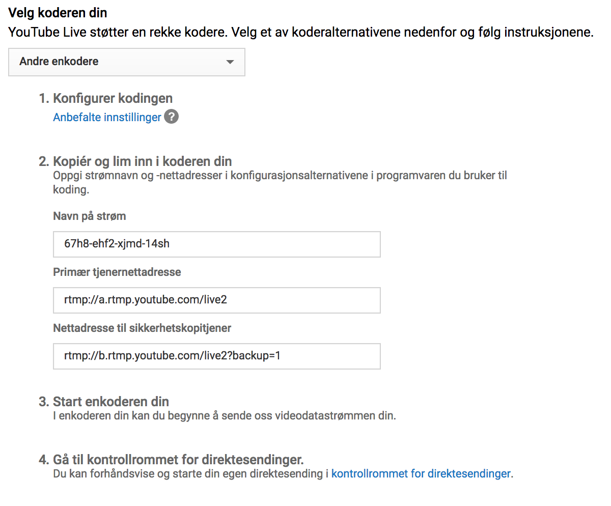
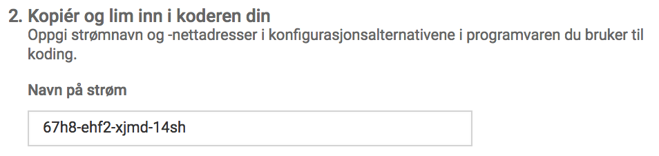
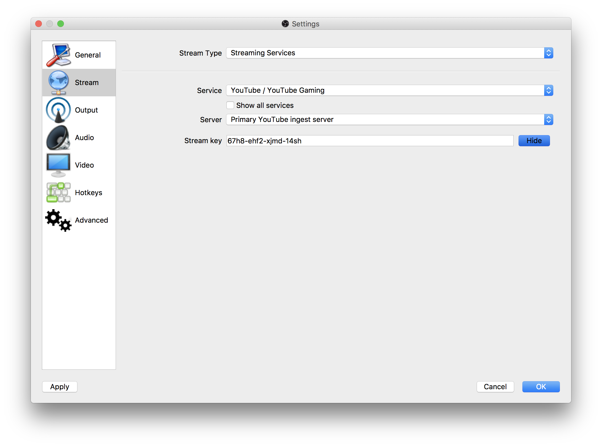
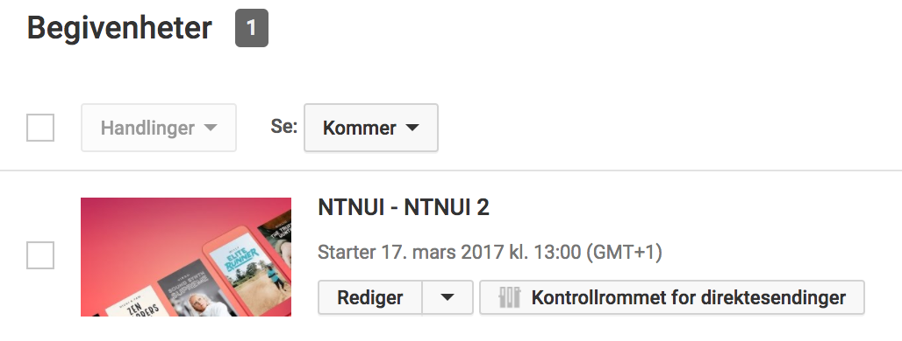
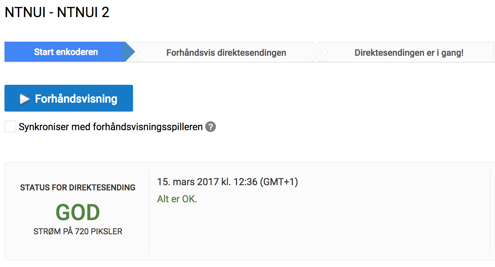

Her kommer en beskrivelse på hvordan man kobler OBS til YouTube.

Det første du må gjøre er å lage en begivenhet på YouTube. Logg inn på YouTube-kontoen din, og gå til [https://www.youtube.com/my_live_events](https://www.youtube.com/my_live_events).

Hvis du ikke har noen direktesendinger enda, så vil du se følgende:

Klikk på **Planlegg en ny direktesending**, eller eventuelt **Ny direktesending**, hvis du har noen i lista fra før.
Du får her opp en del valg knyttet til kampen du skal streame.

* Skriv inn tittelen på videoen, gjerne hvilke lag som spiller.
* Velg dato og tid for når streamen skal starte.
* Legg til en beskrivelse, om du ønsker.
* Under "Type", klikk på **Tilpasset**. Dette er viktig.

Klikk på **"Opprett en direktesending"**.

Du får nå opp flere valg.

* Velg et miniatyrbilde som vises over streamen på YouTube når du ikke sender video.
* Velg **Enkel inkorporering**, og deretter anbefaler vi å velge **1500-4000 kbps (720p)**.
* *Ikke* aktiver 60 bilder per sekund, med mindre du har bra utstyr, og vet hva du holder på med.

* Klikk på **Velg en enkoder**, og velg deretter **Andre enkodere**.

Her får du en oversikt over hva strøm-nøkkelen er, og den skal du lime inn i OBS for å koble OBS til din YouTube-video. Merk at denne er unik for din video, og ikke lik som på bildene her.

* Merk deg hva nøkkelen din er, og kopièr den.

* Åpne OBS Studio.

* Klikk på **Settings**.

* I margen til venstre, klikk på **Stream**.
* Under "Stream Type", velg **Streaming Services**.
* Under "Service", velg **YouTube / YouTube Gaming**.
* Under "Stream Key", lim inn nøkkelen du kopierte fra YouTube.
* Klikk på **OK**.

Nå har du laget et video-arrangement på YouTube, og du har koblet OBS til den videoen.

For å teste at alt virker som det skal, kan vi starte å streame fra OBS, og se om YouTube mottar data.

* I OBS, klikk på **Start Streaming**.
* Gå til [https://www.youtube.com/my_live_events](https://www.youtube.com/my_live_events).

Her ser du en oversikt over dine begivenheter.

* Klikk på **Kontrollrommet for direktesendinger**.

Du får nå opp en kontrollpanel hvor du kan se om OBS sender data, og det er også her du starter og stopper sendingen din på YouTube.

* Sjekk at "STATUS FOR DIREKTESENDING" viser **GOD**.

Du skal nå være klar til å starte med streaming til YouTube.
