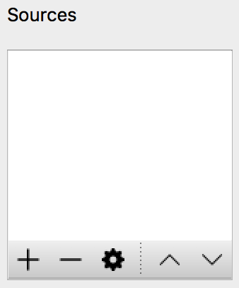
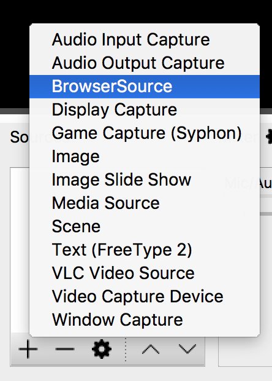
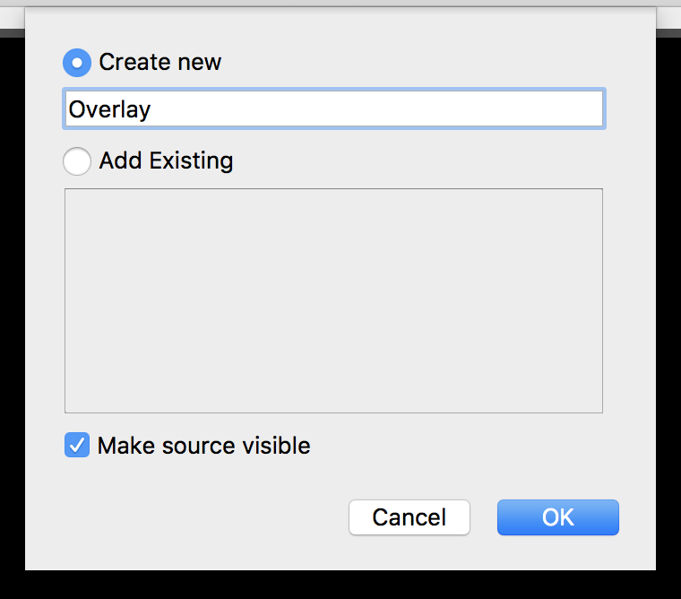
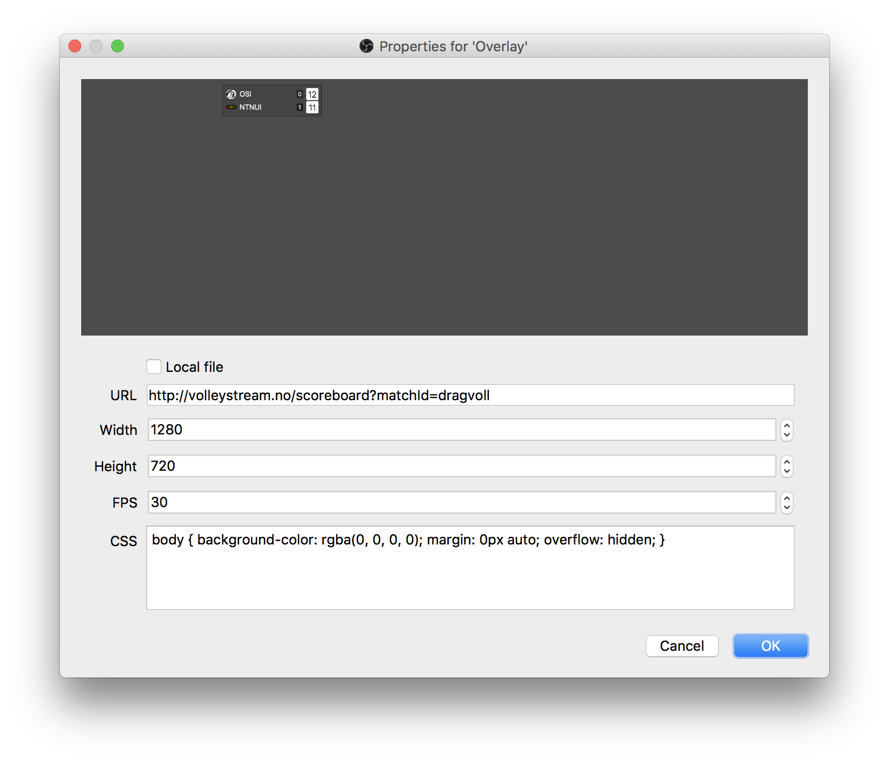

Si at du har fått en nettadresse som du vil legge inn som overlay i OBS.

Her bruker vi et eksempel fra scoreboard-plugingen vår, og vi bruker følgende adresse: [http://volleystream.no/scoreboard?matchId=dragvoll](http://volleystream.no/scoreboard?matchId=dragvoll).

* Først så må du åpne OBS.

* Under **Sources**, klikk på "+"-tegnet, som er nederst til venstre.

* Klikk deretter på **BrowserSource**.

* Lag en ny source, og gi den et valgfritt navn. Vi har her kalt den "Overlay".

* I feltet "URL", fyll inn **adressen** du har fått.
* I feltet "Width", fyll inn **1280**.
* I feltet "Height", fyll inn **720**.
* I feltet "FPS", fyll inn **30** hvis du streamer i 30FPS eller 60 hvis du streamer i 60FPS.

* Klikk på **OK**.

Nå skal overlayet være klar til bruk i OBS.
