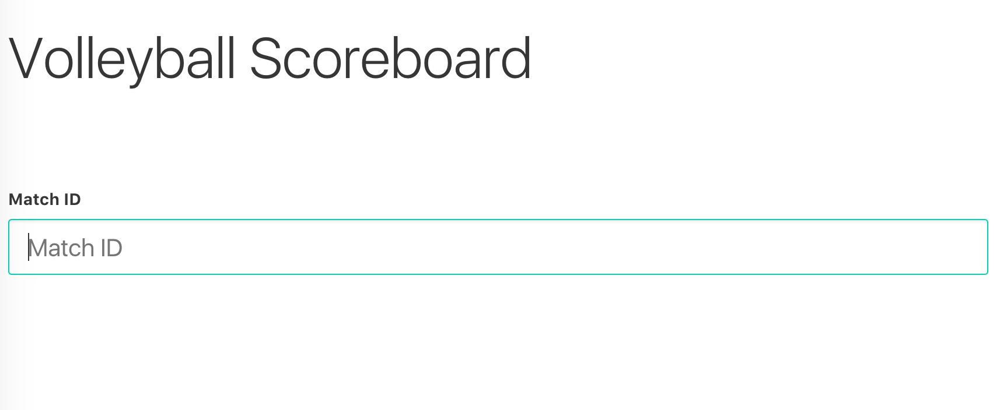
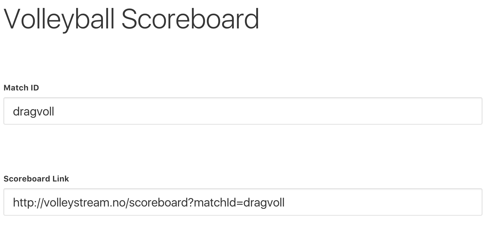
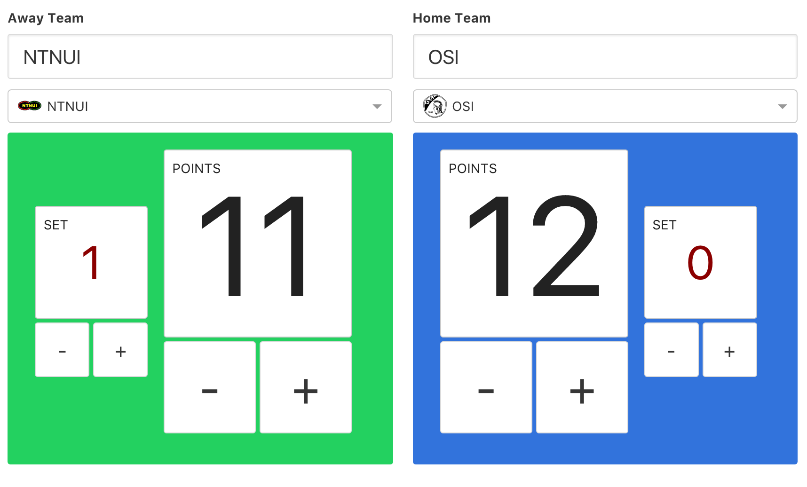
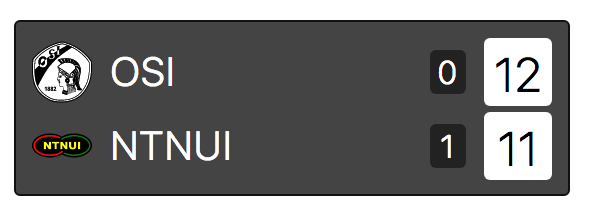

Vi har laget en overlay til OBS som lar deg vise hvilke lag som spiller, og stillinga. Her viser vi hvordan du setter det opp, og hvordan du bruker kontrollpanelet.

### Lag et nytt scoreboard

* Gå inn på <https://www.volleytv.no/score-board/> (midlertidig adresse).

* Skriv inn en valgfri **match ID**. Vi bruker "dragvoll" i dette eksempelet.
  * Det er ikke så farlig hva du skriver, så lenge du husker på det, om du vil styre stillinga på kampen fra for eksempel mobilen.

* Du får nå opp en link. Dette er linken du skal legge inn i OBS.
  * Hvis du lurer på hvordan legger inn linken i OBS: [Hvordan legger man inn overlay i OBS?](obs/legge-inn-overlay-i-obs)

### Velg lag og gi poeng

* Velg hvilke lag som spiller mot hverandre ved å klikke på boksen som sier "Select a logo".
* Velg poeng og sett ved hjelp av pluss og minus-knappene.

### Bytt side og nullstill poeng

Nederst på siden finner du to knapper.
* Den ene knappen, "Reset points", nullstiller poengene til begge lag.
* Den andre knappen, "Flip teams", bytter side på lagene i kontrollpanelet.
  * Det har imidlertid ingen innvirkning på det man ser i streamen, kun for å gjøre det lettere for den som fører poeng.

### Hvordan ser det ut i streamen?

Omtrent sånn her.
